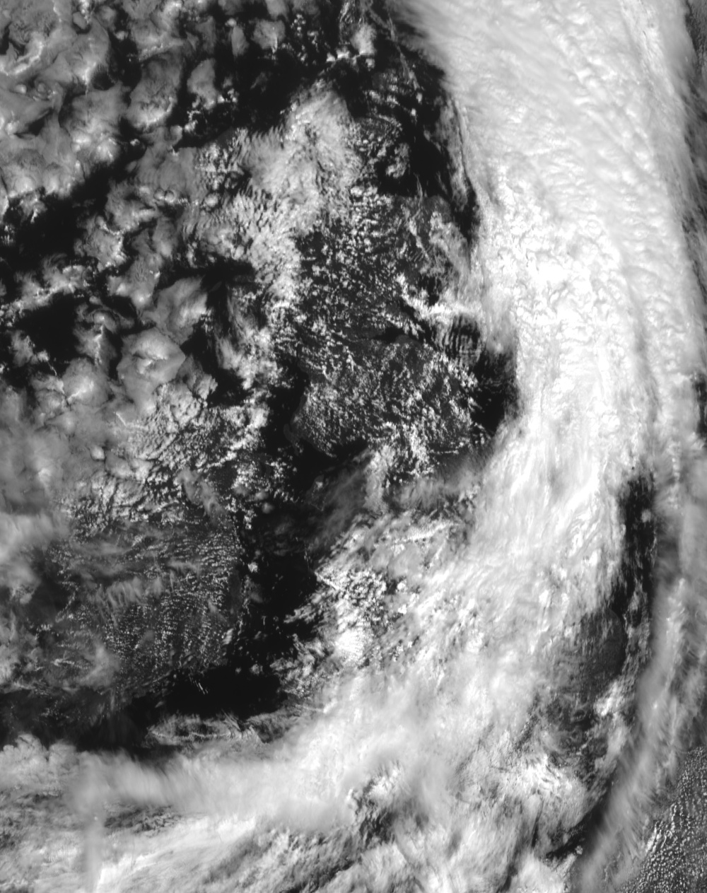
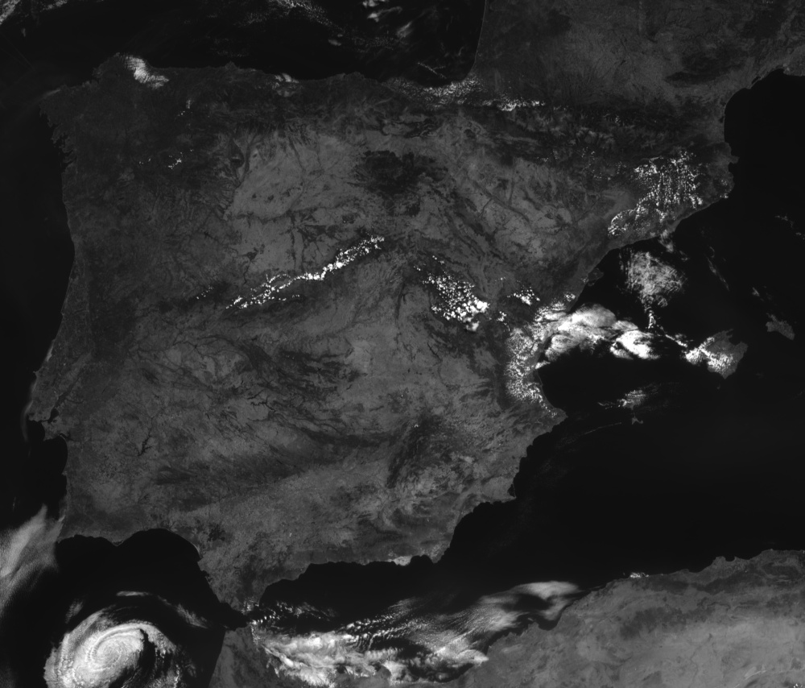
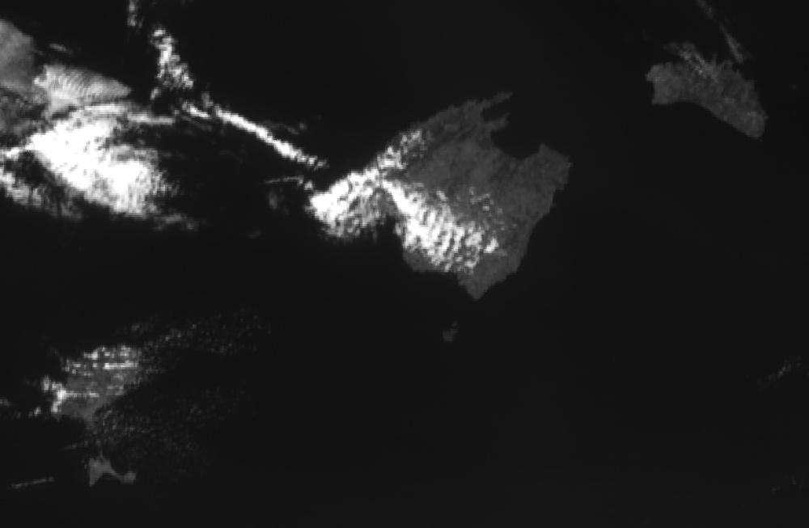
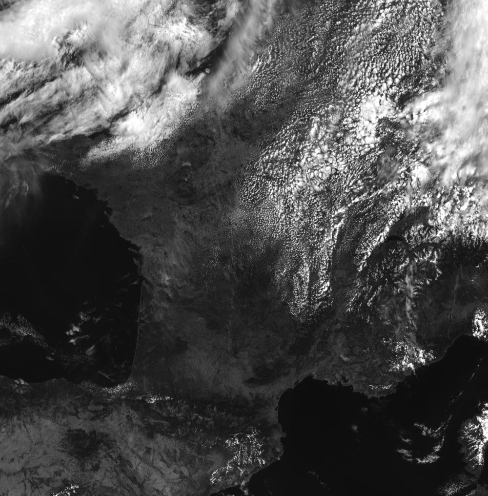
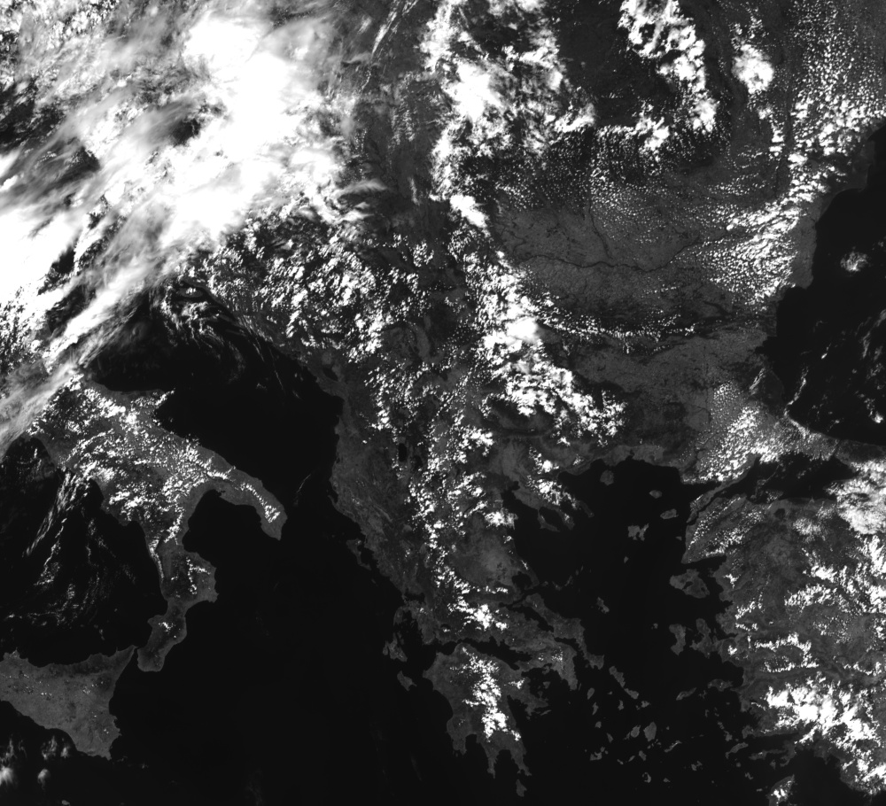
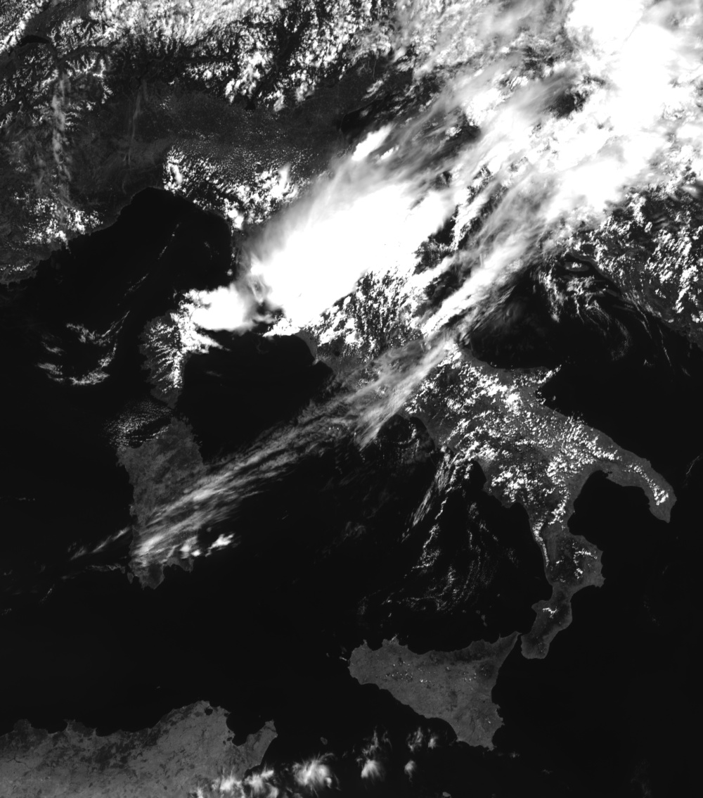
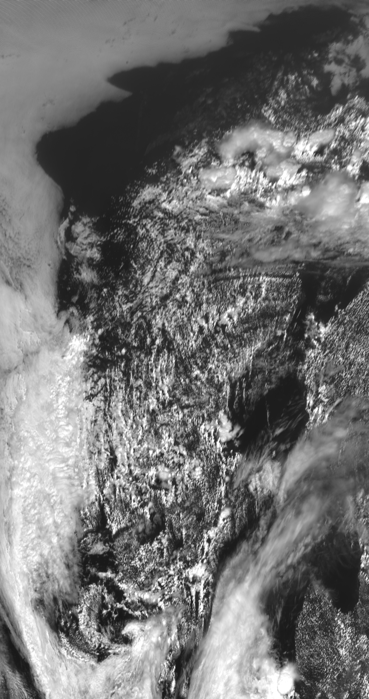

# EUMETSAT MSG/MTG Satellite Imagery Processor

This repository provides Python classes and executable Python files to download, process, and visualize satellite imagery data from the **EUMETSAT Meteosat Second (MSG) and Third (MTG) Generation** FCI instrument. It uses the `eumdac` API to access relevant data collections and can extract imagery based on region, time, and spectral channel. This repository is intended to provide a user-friendly access to Satellite Imagery for Computer Vision and Metheorological Projects. It is planned to gradually add more features and satellites in the available databse.

---

## 🚀 Features

- **Download L1C FCI chunk data** from EUMETSAT for selected regions or custom coordinates.
- **Supports multiple spectral channels:** VIS 06, NIR 22, IR 38, and IR 105 for MTG, and composite datasets for MSG (including isolated bands).
- **Skip night-time imagery** (optional), useful for visible light channels.
- **Custom area or predefined European countries support.**
- **Sun elevation filtering** using `Skyfield` to exclude low-angle sun scenes.
- **Automated image resampling** and export to `.jpg`.
- **Automatic cleanup of downloaded chunks.**
- **Save your images as .npy files for data processing.**
- **10 minutes and 5 minutes time-resolution for MTG and MSG products, respectively.**

## 🌍 Supported Regions
You can select from these predefined countries:
- **iberia** (Spain and Portugal)
- **balearic_islands**
- **france**
- **uk_ireland** (UK and Ireland)
- **germany_benelux** (Germany, Netherlands, Belgique, Switzerland and Luxemburg) 
- **scandinavia** (Norway, Sweden and Denmark)
- **italy**
- **greece**
- **balkans** (North Macedonia, Albania, Kosovo, Montenegro, Bosnia and Herzegovina, Serbia, Croatia, Bulgaria, Romania, Turkey)

Or define a custom bounding box via lat_min, lat_max, lon_min, and lon_max.

## Exmaple Images
<table>
  <tr>
    <td align="center"><br/>UK & Ireland</td>
    <td align="center"><br/>Iberia</td>
    <td align="center"><br/>Balearic Islands</td>
    <td align="center"><br/>France</td>
  </tr>
  <tr>
    <td align="center"><br/>Balkans</td>
    <td align="center"><br/>Italy</td>
    <td align="center"><br/>Greece</td>
    <td align="center"><br/>Scandinavia</td>
  </tr>
</table>

## 🛠️ Requirements

Install dependencies via:

```bash
pip install eumdac satpy pyresample opencv-python skyfield shapely pyproj python-dateutil
```

## Usage
The code can be called from an already built class or via the command line, depicted as follows:

```bash
python EumetSat_MTG_executable.py --consumer_key <...> --consumer_secret <...> --start_date <...> --end_date <...> --output_path <...> --skip_night_angle <...> --country <...> --width <...> --channel <...> --lat_min <...> --lat_max <...> --lon_min <...> --lon_max <...>
```
Each of these parameters are defined below:
Each of these parameters are defined below:

- **consumer_key**: (Mandatory) Consumer key created after your registration in the EumetSat Official Website ([click here](https://user.eumetsat.int/resources/user-guides/data-registration-and-licensing))
- **consumer_secret**: (Mandatory) Consumer secret created after your registration in the EumetSat Official Website ([click here](https://user.eumetsat.int/resources/user-guides/data-registration-and-licensing))
- **start_date**: (Optional) Starting date from where to begin downloading data. Format must be `YYYY-MM-DDTHH:MM:SS` (e.g. `2025-08-01T00:00:00`)
- **end_date**: (Optional) Ending date up to where data will be downloaded. Same format as `start_date`. In case none of start_date and end_date are inputed, the code will look for the latest available picture.
- **output_path**: (Optional) Path to the folder where the downloaded and processed images will be saved. Defaults to `imgs/` directory.
- **skip_night_angle**: (Optional) If set, images will be skipped when the sun elevation is below this angle (e.g. 25).
- **country**: (Optional) Name of the predefined region to process (e.g. `spain`, `france`, `balearic_islands`, `greece`, etc.). If not set, you must define `lat_min`, `lat_max`, `lon_min`, and `lon_max`.
- **channel**: (Optional) Spectral band to download. Options include: `vis_06`, `nir_22`, `ir_38`, `ir_105`. Defaults to `vis_06`, which displays the closest to Natural Color in RB scale (the BW scale has been normalized and enahnced to make it more appealing)
- **lat_min**: (Optional) Minimum latitude of a custom region. Required only if using custom bounding box instead of `country`.
- **lat_max**: (Optional) Maximum latitude of a custom region.
- **lon_min**: (Optional) Minimum longitude of a custom region.
- **lon_max**: (Optional) Maximum longitude of a custom region.
- **save_as_npy**: (Optioanl) Save the images as .npy files for later-on image preprocess.
- **enhance_img**: (Optional) Enhance contrast of images normalizing between 99% and 1% quantiles.

## 🛰️ Supported Channels

| Satelite Family | Channel | Type     | Wavelength (µm) | Resolution (m) | Data Update (every n minutes) |
|--------|---------|----------|------------------|----------------|---------------|
|MTG | vis_06  | Visible  | 0.59–0.69        | 500            |  10  |
|MTG | nir_22  | Near-IR  | 2.2–2.3          | 500            |  10  |
|MTG | ir_38   | Infrared | 3.4–4.2          | 1000           |  10  |
|MTG | ir_105  | Infrared | 9.8–11.2         | 1000           |  10  |
| MSG              | HRV     | Visible    | 0.5 – 0.9       | 1000           | 5                 |
| MSG              | IR\_016 | Near-IR    | 1.5 – 1.78      | 3000           | 5                 |
| MSG              | IR\_039 | Infrared   | 3.48 – 4.36     | 3000           | 5                 |
| MSG              | IR\_087 | Infrared   | 8.3 – 9.1       | 3000           | 5                 |
| MSG              | IR\_097 | Infrared   | 9.38 – 9.94     | 3000           | 5                 |
| MSG              | IR\_108 | Infrared   | 9.8 – 11.8      | 3000           | 5                 |
| MSG              | IR\_120 | Infrared   | 11.0 – 13.0     | 3000           | 5                 |
| MSG              | IR\_134 | Infrared   | 12.4 – 14.4     | 3000           | 5                 |
| MSG              | VIS006  | Visible    | 0.56 – 0.71     | 3000           | 5                 |
| MSG              | VIS008  | Visible    | 0.74 – 0.88     | 3000           | 5                 |
| MSG              | WV\_062 | Water Vap. | 5.35 – 7.15     | 3000           | 5                 |
| MSG              | WV\_073 | Water Vap. | 6.85 – 7.85     | 3000           | 5                 |
| MSG              | 24h\_microphysics               | 3000           | 5                 |
| MSG              | airmass                         | 3000           | 5                 |
| MSG              | ash                             | 3000           | 5                 |
| MSG              | cloud\_phase\_distinction       | 3000           | 5                 |
| MSG              | cloudtop                        | 3000           | 5                 |
| MSG              | cloudtop\_daytime               | 3000           | 5                 |
| MSG              | colorized\_ir\_clouds           | 3000           | 5                 |
| MSG              | convection                      | 3000           | 5                 |
| MSG              | day\_microphysics               | 3000           | 5                 |
| MSG              | dust                            | 3000           | 5                 |
| MSG              | fog                             | 3000           | 5                 |
| MSG              | hrv\_clouds                     | 1000           | 5                 |
| MSG              | hrv\_fog                        | 1000           | 5                 |
| MSG              | hrv\_severe\_storms             | 1000           | 5                 |
| MSG              | ir108\_3d                       | 3000           | 5                 |
| MSG              | ir\_overview                    | 3000           | 5                 |
| MSG              | ir\_sandwich                    | 3000           | 5                 |
| MSG              | natural\_color                  | 3000           | 5                 |
| MSG              | natural\_color\_with\_night\_ir | 3000           | 5                 |
| MSG              | night\_fog                      | 3000           | 5                 |
| MSG              | night\_microphysics             | 3000           | 5                 |
| MSG              | overshooting\_tops              | 3000           | 5                 |
| MSG              | overview                        | 3000           | 5                 |
| MSG              | realistic\_colors               | 3000           | 5                 |
| MSG              | snow                            | 3000           | 5                 |
| MSG              | vis\_sharpened\_ir              | 3000           | 5                 |

## Notes

- Chunk geometry file ```FCI_chucnks.wkt``` is required for spatial filtering. Place it on your current working directory (where the code is located).
## Licensing
MIT License
